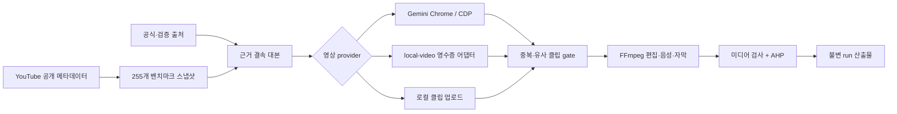

# PS4 AI Video Studio

플스포컴퍼니의 AI Shorts 제작 과제를 염두에 둔 로컬 우선 제작·검증 웹앱입니다. 공개 YouTube 채널 `신비한 건축사전`의 메타데이터와 제목 패턴을 벤치마킹하고, 새 주제의 근거 수집, AI 장면 생성, FFmpeg 편집, 한국어 자막·내레이션, 품질 증거 봉인을 하나의 작업(run)으로 연결합니다.

> 이 저장소는 현재 **제출 준비 중인 엔지니어링 프로토타입**입니다. 2026-08-12에 당시 schema v4 계약으로 Headless Chrome의 Gemini가 만든 서로 다른 2개 클립에서 20초 세로 MP4·한국어 자막·내레이션까지 무인 E2E를 완주했습니다. source run `2026-08-12T15-03-35-456Z-4d0599`를 provider 요청 없이 재사용한 schema v2 `purpose-aware-semantic-verdict` child run `2026-08-12T16-47-14-022Z-c73889`는 당시 append-only revision에서 자동 품질 계약을 통과했습니다. 그러나 현재 schema v5는 실제 Chrome 실행 인자와 대화 target lineage를 추가로 요구하며, 역사적 schema v4 run에는 그 증거가 없습니다. 따라서 이 결과는 과거 실행 기록일 뿐 현재 코드의 terminal-valid 제출 증거가 아니며, 새 schema v5 E2E가 필요합니다. 5개 review도 모두 결정론적 software method이고 `human:false`, `independentPrincipal:false`입니다.

## 현재 검증 상태

2026-08-12에 저장된 스냅샷 기준입니다.

| 영역 | 확인된 상태 |
| --- | --- |
| 채널 인덱스 | 255개 전수: Shorts 251개 + 롱폼 4개, 고유 ID 255개 |
| Shorts 길이 | 전체 중앙값 78초, 최근 30개 중앙값 110초, 최근 사분위 범위 96–122초 |
| 전수 분석 범위 | 255개 제목·조회수·길이·해상도 메타데이터와 휴리스틱 제목 분류 |
| 미디어 분석 범위 | 시간축 분산 12개 컨테이너 분석: 영상 12, 오디오 11, 자막 11, 완전한 LUFS/true-peak 측정 2. 전 채널을 대표하지 않음 |
| 로컬 웹앱 | 채널 탐색, 작업 생성, 진행 상태, 산출물, AHP 계측·기술 증거 gate 표시 구현 |
| Gemini | Chrome 151 Headless, 전용 프로필, 2개 720×1280·10.005초 클립을 생성해 1080×1920·20.033초 최종 MP4까지 완주. 입력 SHA-256 고유, temporal aHash 거리 32.375, motion gate 2/2 통과 |
| FLUX 3 | 공식 BFL API용 `local-video` 어댑터, 비용 상한, 체크포인트·재개, 다운로드 검증 구현. 2026-08-12 로컬 환경에서 API 키가 설정되지 않아 유료 호출 및 생성 E2E는 미수행. 대시보드 잔액 0은 불변 run에 봉인되지 않은 시점성 운영 관측 |
| 최종 판정 | job `2026-08-12T12-30-22-674Z-f0418e`는 당시 schema v4 계약에서 `completed`/`verified`였으나, 현재 schema v5가 요구하는 runtime/target lineage가 없어 `legacy-unverifiable`. 새 schema v5 E2E 전에는 현재 제출 완료로 간주하지 않음 |

`data/channel-analysis.json`의 “전수 분석”은 공개 메타데이터와 제목 문맥 규칙 분석입니다. `editorialHypothesis`의 서사·시각 언어는 이 제목 분석에서 세운 제작 가설이며 측정된 시청각 관측값이 아닙니다. 모든 영상 내용을 사람이 시청했거나 모든 프레임을 분석했다는 뜻이 아닙니다. 표본 미디어 분석은 별도 영수증으로 분리되어 있습니다.

## 무엇을 구현했나

- `yt-dlp`로 Videos/Shorts 목록을 각각 수집하고 누락된 조회수·길이·해상도가 있으면 스냅샷 저장을 중단합니다.
- 최근 30개 Shorts의 110초 프로필을 새 작업의 기본 목표 길이로 사용합니다.
- 검증 출처를 가져와 SHA-256, 바이트 수, 본문 위치와 인용문을 저장합니다. 대본의 각 주장은 저장된 인용문과 정확히 결속되어야 합니다.
- 공식 Higgsfield MIT 자료와 공개 학습 문서를 출처로 한 provider-neutral shot pattern을 결정론적으로 선택합니다. extractive `visualPrompt`는 변경하지 않고 카메라·연속성 suffix를 별도 `providerVisualPrompt`로 생성해 Gemini/`local-video` 요청과 불변 영수증에 결속합니다. 공개 웹 프롬프트·미디어·에셋은 복제하지 않습니다.
- 세 가지 입력 모드를 지원합니다: Gemini Chrome 생성, 영수증 기반 `local-video` 생성기, 사용자가 제공한 로컬 클립 편집.
- 입력 클립마다 SHA-256과 시간축 perceptual fingerprint를 계산하여 동일·유사 클립을 렌더 전에 차단합니다.
- FFmpeg/ffprobe로 작업 설정에 맞춘 9:16/16:9 정규화, 이어붙이기, 음성 합성, 자막 번인, 썸네일 추출, 프레임·음량·무음·자막 검사를 수행합니다.
- 작업별 이벤트 로그, 입력 manifest, provider 영수증, 벤치마크 스냅샷과 최종 산출물을 run ID에 묶어 저장합니다.
- AHP 계측과 별도로 provider provenance, 출처 텍스트, 불변 산출물, 5-method software attestation payload를 요구하는 기술 증거 gate를 둡니다. 역사적 schema v4 revision의 5개 reviewer는 모두 `human:false`, `independentPrincipal:false`였습니다. 이 스키마는 실제 전문가 참여나 신원·독립성, 영상의 주제 관련성·사실성·미학을 증명하지 않습니다.



자세한 구성과 위협 모델은 [`docs/architecture.md`](docs/architecture.md), 오픈소스 선택 근거는 [`docs/oss-decisions.md`](docs/oss-decisions.md), Higgsfield 학습 자료의 권리·재사용 경계는 [`docs/higgsfield-learning-sources.md`](docs/higgsfield-learning-sources.md)를 참고하세요.

## 요구 사항

- 지원 런타임은 macOS 또는 `renameat2`를 제공하는 glibc Linux입니다. musl Linux와 Windows는 현재 fail-closed로 중단됩니다.
- macOS에서는 내레이션에 시스템 `say`를 사용합니다. `voiceover=false`는 `say` 의존성만 제거하며 위 네이티브 저장소 요구 사항을 완화하지 않습니다.
- [Bun](https://bun.sh/) 1.3 계열
- [Node.js](https://nodejs.org/) (`bun run check`의 실행 없는 구문 검사에만 사용)
- [FFmpeg](https://ffmpeg.org/)와 `ffprobe`
- [yt-dlp](https://github.com/yt-dlp/yt-dlp)
- Gemini 모드 사용 시 Google Chrome/Chromium과 사용자가 직접 로그인한 전용 프로필
- FLUX 3 실호출 시 별도로 발급한 BFL API 키와 크레딧

macOS에서 핵심 미디어 도구는 다음처럼 설치할 수 있습니다.

```bash
brew install ffmpeg yt-dlp
```

도구 버전과 설치 여부는 웹앱의 상태 패널과 `GET /api/health`에서 확인할 수 있습니다.

## 빠른 시작

```bash
cp .env.example .env
bun run start
```

서버는 workspace 단일-owner flock과 inert `503` loopback socket으로 runtime·port를 먼저 예약한 뒤 out-of-band Bearer token을 `workspace/.runtime/studio-token`에 mode `0600`으로 게시하고, 복구가 끝나야 실제 handler를 활성화합니다. 터미널의 `http://127.0.0.1:3000/#token=…` 링크로 브라우저를 열면 fragment는 HTTP 요청에 포함되지 않고 페이지가 즉시 소비·제거하며, token은 해당 exact origin 탭의 `sessionStorage`에만 보관됩니다. 링크 대신 token 파일의 값을 잠금 화면에 직접 붙여 넣어도 됩니다. 모든 API 요청은 이 token의 `Authorization: Bearer …`를 요구하고, 변경 요청은 exact same-origin `Origin` 및 브라우저가 보낸 `Sec-Fetch-Site: same-origin` 경계도 통과해야 합니다. 산출물 링크에는 master token 대신 정확한 job·산출물 경로에 묶인 최대 1시간의 GET/HEAD 전용 capability를 사용하며, 다른 API 권한을 부여하지 않습니다.

이 singleton lease가 도입되기 전에 생성된 token 파일이 있으면, 먼저 모든 구버전 Studio 프로세스가 종료되었음을 확인한 다음 정확히 한 번 `PS4_ALLOW_SERVER_LEASE_MIGRATION=1 bun run start`로 이관하세요. 승인 없이 기존 token을 자동 takeover하지 않으며, 이관 후에는 평소처럼 `bun run start`를 사용합니다. 이관이 끝난 뒤에는 lease protocol을 모르는 구버전 바이너리를 다시 실행하지 마세요. 동일 사용자 권한으로 실행된 구버전 프로세스는 새 kernel lease에 참여하도록 강제할 수 없습니다.

개발 중 자동 재시작은 다음 명령을 사용합니다.

```bash
bun run dev
```

### 제작 모드

1. **Gemini · Chrome 자동 조작**: 최초 로그인이나 세션 갱신은 `GEMINI_CHROME_HEADLESS=0`으로 전용 프로필을 한 번 띄워 사람이 직접 완료합니다. Chrome을 완전히 종료한 뒤 기본값인 headless 모드로 돌아오면 같은 프로필의 쿠키·세션을 재사용합니다. 자동화는 로그인, CAPTCHA, 쿼터를 우회하지 않습니다.
2. **local-video 생성기**: 절대 경로의 실행 파일을 `PS4_LOCAL_VIDEO_GENERATOR`에 지정합니다. 생성기는 stdin 요청과 현재 run에 결속된 JSON 영수증을 반환해야 합니다.
3. **로컬 클립 업로드**: 작업 생성 후 여러 클립을 업로드하고 편집을 시작합니다. 이 모드는 편집 검증용이며 AI provider 기술 증거 gate 통과를 주장할 수 없습니다. `POST /api/jobs/:id/clips` multipart 요청은 사용자가 확인한 현재 포인터를 결속하기 위해 정확히 하나의 `expectedRunId` 문자열(아직 실행 전이면 빈 문자열)을 함께 보내야 합니다.

모든 작업 산출물은 기본적으로 `workspace/jobs/<job-id>/` 아래에 저장됩니다. `workspace/`는 저장소에 커밋하지 않습니다.

## 벤치마크 재생성

채널 공개 상태는 변하므로 제출 직전에 다시 생성하세요.

```bash
bun run benchmark:refresh
```

이 명령은 아래 순서로 실행됩니다.

```text
channel:refresh → benchmark:metadata → analyze → quality:rlm
```

결과 파일은 다음과 같습니다.

- `data/channel-shorts.json`, `data/channel-videos.json`: 원본 목록 스냅샷
- `data/shorts-metadata.json`: 길이·해상도 통계와 최근 30개 프로필
- `data/channel-analysis.json`: 255개 제목/메타데이터 기반 분류와 provenance
- `data/rlm-benchmark-analysis.json`: 251개 Shorts의 재귀 집계 영수증

미디어 표본은 네트워크와 저장 공간을 사용하므로 별도 실행합니다. 기본값은 시간축으로 분산 선택한 12개입니다. 현재 영수증은 12개 선택과 12개 컨테이너 분석을 증명합니다. 커밋된 영수증은 자막 cue/word 원문과 개별 timing record를 제거하고 집계값·언어·바이트·SHA-256만 보존합니다. 이는 채널 전수의 시청각 의미 분석이 아니라 비대표 표본입니다.

```bash
BENCHMARK_LIMIT=12 bun run benchmark:media
bun run quality:rlm
```

자동 자막도 내려받으려면 `BENCHMARK_SUBS=1`을 추가합니다. YouTube 이용약관과 저작권을 확인하고 필요한 범위에서만 실행하세요.

## Gemini 설정과 모니터링

기본 단일 프로필 설정:

```dotenv
CHROME_CDP_URL=http://127.0.0.1:9222
CHROME_PROFILE_DIR=/Users/you/.ps4-ai-video-studio/chrome-profile
GEMINI_VIDEO_TIMEOUT_MS=1200000
GEMINI_CHROME_HEADLESS=1
GEMINI_CHROME_BACKGROUND=0
```

`CHROME_PROFILE_DIR`는 `~/.ps4-ai-video-studio/` 안의 전용 경로여야 합니다. 일상용 Chrome 프로필을 공유하지 마세요. 런타임 기본값은 창을 열지 않는 Chrome `--headless=new`이며 Chrome 109 이상을 요구합니다. CDP는 `127.0.0.1`에만 결속되고, 요청한 headless/visible 모드와 이미 해당 포트에 떠 있는 Chrome의 실제 모드가 다르면 자동화는 새 창이나 요청을 만들지 않고 중단합니다.

영상 1개 결과 대기 기본값은 20분이며 `GEMINI_VIDEO_TIMEOUT_MS`에는 5분~60분 범위의 정수 밀리초만 허용됩니다. 타이머는 제출 확인과 체크포인트 저장 뒤 시작됩니다. 결과가 늦어 시간 초과되면 제출된 Gemini 대화 탭을 닫지 않고 CDP만 분리합니다. 같은 작업·대본·프로필 결속으로 재실행할 때 정확히 하나의 기존 대화 탭이 확인되어야 그 결과부터 회수하며, 탭이 없거나 중복되어 모호하면 중복 생성을 막기 위해 새 요청을 보내지 않습니다.

체크포인트 기능 도입 전의 legacy 실패 영수증은 실제 제출 여부를 증명하지 못하므로 자동 재전송하지 않습니다. 운영자가 폐기를 명시적으로 승인하면 CLI가 저장된 job의 loopback CDP를 읽기 전용으로 조회합니다. 저장된 세션과 결속된 live headless Chrome, 정확한 `gemini-generation.json` SHA-256, Gemini 대화·생성 target 0개가 모두 확인될 때만 1회성 폐기 영수증을 생성합니다. 관측에는 origin·브라우저·target 집합의 해시와 개수·시각만 남기며 target URL/ID는 저장하지 않습니다. 이는 로컬 target 부재에 대한 증거이지 provider 측 생성 취소를 보장하지 않습니다. 승인된 legacy generation 원본과 폐기 영수증은 덮어쓰기 전에 `legacy-gemini-evidence/`에 그대로 보존됩니다. 이 명령은 영상 생성 요청을 보내거나 Chrome UI를 조작하지 않습니다.

```bash
bun run gemini:abandon-legacy -- \
  --job '<job-id>' \
  --expected-generation-sha256 'sha256:<64-hex>' \
  --assert-no-live-target \
  --reason '기존 Gemini 대화 target이 없음을 운영자가 확인함'
```

최초 로그인 또는 세션 갱신이 필요할 때만 `GEMINI_CHROME_HEADLESS=0`과 `GEMINI_CHROME_BACKGROUND=0`으로 같은 전용 프로필을 열어 사람이 로그인합니다. 로그인 후 그 전용 Chrome을 **완전히 종료**하고 `GEMINI_CHROME_HEADLESS=1`로 되돌린 다음 서버와 모니터를 재시작하세요. 동일한 `CHROME_PROFILE_DIR`의 쿠키·세션이 재사용되지만, 만료된 로그인이나 CAPTCHA는 headless에서 우회하지 않고 명시적으로 실패합니다. 근거 결속 대본은 캡처한 출처 문장에서 로컬·결정론적으로 구성하며 별도 텍스트 provider 요청을 보내지 않습니다.

서버가 실행 중일 때 쿼터 감시와 자동 재개를 시작할 수 있습니다.

```bash
bun run monitor:gemini
```

모니터는 서버가 만든 mode `0600` 토큰 파일을 읽어 Bearer 인증하고, `workspace/gemini-monitor.json` 및 JSONL 로그를 mode `0600`으로 갱신합니다. 계정 이름·이메일, Chrome profile 경로, Gemini 페이지 본문은 상태·로그·UI·API에 저장하지 않으며 이전 버전 산출물도 시작 시 일방향으로 제거합니다. 쿼터 시각·가용성처럼 자동 재개에 필요한 운영 정보만 남깁니다. 기본 최대 실행 시간은 7일이며 최초 `startedAt`과 `deadlineAt`을 상태에 고정하므로 프로세스를 재시작해도 실행 시간이 연장되지 않습니다. 이전 버전 상태에 `deadlineAt`이 없으면 원래 `startedAt`에 최대 실행 시간을 더해 한 번만 이관하고, 저장된 시작·마감 경계가 유효하지 않으면 새 시간을 부여하지 않고 fail-closed로 종료합니다. 재시도 상한에 도달하면 이전 job/run/profile 포인터와 시도 횟수를 명시적인 null/0 전이로 초기화합니다. 이 명령은 사용 가능한 쿼터를 발견하면 실제 생성 작업을 만들 수 있으므로 계정·주제·출처 설정을 먼저 검토하세요.

각 쿼터 관측 전에 모니터가 전용 CDP 포트와 저장된 프로필을 확인하며, 프로세스가 내려갔으면 기본 `--headless=new` 정책으로 다시 시작합니다. 이미 열린 Chrome이 요청 모드와 다르거나 로그인 세션이 만료된 경우에는 자동 우회하지 않고 blocker를 기록합니다.

## 승인 provider 클립 동작 gate

Gemini와 `local-video` 생성 클립은 편집 전에 `ffmpeg-luma-motion-32x32-v1` 검사를 통과해야 합니다. FFmpeg가 디코딩한 32×32 grayscale 프레임으로 첫 1초의 동작 시작 시점과 전체 구간의 움직이는 전환율, 고유 프레임율, 인접 근중복률, 최장 정지 구간을 계산합니다. 파일 SHA-256만 다른 단색 정지 영상이나 소수 프레임 반복 영상은 통과하지 못합니다.

측정값과 고정 threshold는 input manifest schema v3에 저장되고, quality 평가가 원본 클립에서 다시 계산한 영수증과 바이트 단위 canonical hash로 일치해야 `inputMotionGateBinding`이 열립니다. 로컬 업로드 모드는 편집 fixture이므로 같은 지표를 표시하지만 제출용 provider gate로 강제하지 않습니다. 이 기술 검사만으로 `semanticGate`가 열리지는 않으며, schema v2 목적별 의미 영수증을 별도로 통과해야 합니다.

## FLUX 3 / BFL 어댑터

[`scripts/bfl-flux-video-generator.mjs`](scripts/bfl-flux-video-generator.mjs)는 BFL의 공식 `POST /v1/flux-3-video` 계약을 `local-video` 프로토콜에 맞춥니다. 각 장면을 직렬 제출하고, task ID를 체크포인트에 기록한 뒤 polling·HTTPS delivery URL·미디어 크기·SHA-256을 검증합니다. 제출 결과가 모호하면 중복 과금을 피하기 위해 자동 재제출하지 않습니다.

```dotenv
PS4_LOCAL_VIDEO_GENERATOR=/absolute/path/to/scripts/bfl-flux-video-generator.mjs
BFL_API_KEY=
BFL_VIDEO_RESOLUTION=hd
BFL_ESTIMATED_CREDITS_PER_SECOND=17
BFL_MAX_CREDITS=2000
```

실호출에는 **API 키, 공식 단가 이상인 비용 추정치, 최대 크레딧 상한, 현재 작업에 결속된 명시적 1회 유료 승인**이 모두 필요합니다. 웹 UI는 `local-video` 작업을 대기 상태로만 만들며 승인 없이 자동 실행하지 않습니다. 현재 내장 안전 견적은 full render 기준 HD 17 credits/초, FHD 29 credits/초입니다. 현재 대기 작업처럼 2×10초를 생성하면 HD 340 credits(USD 3.40), FHD 580 credits(USD 5.80)입니다. 각 클립은 최소 5초로 청구되므로, 예를 들어 총 목표가 20초여도 12개 클립이면 60초(HD 1,020 credits)부터 계산됩니다. 가격은 바뀔 수 있으므로 승인 직전에 [BFL 문서](https://docs.bfl.ai/flux_3/flux3_overview)와 대시보드 잔액을 다시 확인하세요.

먼저 네트워크 요청 없이 현재 작업·어댑터·견적 결속을 확인합니다.

```bash
bun run bfl:approval --inspect --job <job-id>
```

출력된 `contextHash`, `officialQuoteCredits`, 환경의 `BFL_MAX_CREDITS`를 직접 확인한 뒤에만 만료 시간이 짧은 1회 승인을 만듭니다. 아래 값은 예시이므로 inspect 결과와 정확히 일치해야 합니다.

```bash
bun run bfl:approval --approve \
  --job <job-id> \
  --expected-context-hash <sha256:...> \
  --quote-credits 340 \
  --max-credits 340 \
  --assert-one-paid-attempt yes \
  --expires-at 2026-08-13T01:00:00Z \
  --reason "Reviewed balance and approved this exact render"
```

승인 영수증은 mode `0600`으로 저장되고 최초 `/run` 요청에서 원자적으로 소비됩니다. 이후 정확한 job/run/request/script, API-key fingerprint, 어댑터 바이트, 각 POST body 정책, request claim과 단일 provider executor가 다시 결속됩니다. 승인 만료는 실제 POST 직전에도 재검증되고, 승인·claim 원문은 최종 provider 영수증에 봉인됩니다. 하나라도 바뀌거나 이미 claim됐으면 fail-closed로 중단됩니다. 이 승인은 잔액을 충전하거나 결제·trial을 활성화하지 않으며, BFL이 서버 측 비용 ceiling을 제공한다는 뜻도 아닙니다. 첫 provider 요청의 비용 노출을 포함하므로 실제 잔액을 별도로 확인해야 합니다.

`BFL_DRY_RUN=1`은 stdin 요청을 검증하고 네트워크 요청 0건의 계획 영수증을 출력합니다. dry-run 영수증은 의도적으로 완성 클립 영수증이 아니므로 웹 파이프라인의 완료 run으로 받아들여지지 않습니다.

2026-08-12 확인 당시 이 개발 환경에는 BFL API 키가 설정되지 않았습니다. 대시보드 잔액 0은 당시 UI에서 본 시점성 운영 관측일 뿐 불변 run이나 저장소 영수증에 봉인되지 않았습니다. 저장소의 테스트와 CI는 BFL/Gemini 실서비스를 호출하지 않습니다.

2026-08-11 BFL은 Arena 순위 발표를 기념해 **BFL 웹 플레이그라운드**의 FLUX 3 Video를 8월 16일 23:59 PT(한국 시간 8월 17일 15:59)까지 무료로 제공한다고 [공식 공지](https://x.com/bfl_ai/status/2087217791900491839)했습니다. 공개 공지는 API 무료 적용, 계정별 횟수·동시성, 지역·카드·상업 이용 조건을 명시하지 않습니다. 따라서 이 저장소의 API 어댑터와 위 유료 승인 계약에는 프로모션을 자동 적용하지 않습니다. 로그인된 플레이그라운드에서 표시 비용 0, 계정 조건, 생성 전후 크레딧 불변을 확인하기 전에는 무료라고 추정해 API 또는 일괄 생성을 시작하지 않습니다.

[Arena의 2026-08-10 공식 스냅샷](https://arena.ai/leaderboard/text-to-video)에서는 FLUX 3 Video가 1496±17점으로 `Preliminary` 2위이고 Gemini Omni Flash는 1512±11점으로 1위입니다. 명목 점수 차이는 16점이지만, FLUX 3 표본은 1,288표로 Gemini의 15,930표보다 작으므로 확정 순위가 아니라 **잠정 2위**로 표현합니다.

여러 클립 생성 자체는 가능합니다. [공식 모델 사양](https://bfl.ai/models/flux-3)에 따르면 한 번의 생성은 최대 20초이고 한 영상 안의 여러 장면, 반복 생성한 클립의 agentic chaining 및 video continuation을 지원합니다. 다만 프로모션 공지에는 무료 생성 횟수나 동시성 상한이 공개되어 있지 않으므로 “여러 클립 가능”을 “무제한 무료”로 해석하지 않습니다. 현재 공개 출력은 HD/FHD이며 text/image/video-to-video, keyframe 및 단일 이미지·영상 reference 입력이 문서화되어 있습니다. BFL은 같은 [공식 공지](https://x.com/bfl_ai/status/2087217791900491839)에서 4K, video editing, multiple images & videos as reference input을 다음 기능으로 예고했습니다. 즉 4K와 여러 이미지·영상의 동시 참조는 현재 사양이 아니라 공식 로드맵입니다.

프로모션을 활용하는 안전한 수동 경로는 로그인된 BFL Playground에서 각 클립의 표시 비용이 0인지 확인해 생성·다운로드한 뒤 이 앱의 `local` 업로드 모드로 편집하는 것입니다. 이 경로는 무료 Playground 사용과 편집은 가능하게 하지만 API task ID·요청 본문 영수증이 없으므로 BFL provider 증거 gate를 통과한 제출용 run으로 가장하지 않습니다.

## 테스트

```bash
bun test
bun run check
```

구문 검사까지 로컬에서 CI와 동일하게 확인하려면:

```bash
for file in src/*.mjs scripts/*.mjs public/*.js test/*.mjs tests/*.mjs; do node --check "$file"; done
```

CI는 Git이 추적하는 릴리스 파일·상대 import 폐쇄 검사, Bun 테스트, Node 구문 검사와 whitespace 검사를 수행합니다. 브라우저 자동화, YouTube 다운로드, Gemini API, BFL API, 유료 생성은 실행하지 않습니다.

`test/offline-schema5-lifecycle.test.mjs`는 임시 작업공간에서 인증된 job 생성·실행 라우트부터 FFmpeg 렌더링, schema v5 형식의 **provider simulator** 영수증, 의미 영수증의 fail-closed 생성, 품질 봉인, stale pointer 재수화, Range 산출물 응답까지 재현합니다. source fetch·Gemini·BFL·OMLX 실서비스는 호출하지 않으며, 시뮬레이터의 runtime/target 필드는 실제 Chrome 관측 증거가 아닙니다. 따라서 이 테스트는 코드 수명주기와 영수증 폐쇄 회귀를 검증할 뿐 위의 “새 schema v5 실제 provider E2E” 완료 조건을 충족하지 않습니다. `voiceover:false`에서는 narration 증거 부재를 실패 영수증으로 봉인하고 `needs-improvement`를 유지합니다.

## 보안 운영 원칙

- `HOST=127.0.0.1`을 유지하세요. 인증이 있더라도 이 앱을 공용 인터넷에 직접 노출하도록 설계하지 않았습니다.
- `workspace/.runtime/studio-token`과 Chrome 프로필은 비밀로 취급하고 공유·커밋하지 마세요.
- `PS4_STUDIO_TOKEN`을 직접 정하면 공백 없는 32바이트 이상의 무작위 값을 사용하세요. 비워 두면 첫 안전 시작에 생성하고 이후 canonical token 파일을 재사용합니다. 기존 값과 다른 명시 token은 자동 교체하지 않습니다.
- 시작 URL의 `#token` fragment는 페이지가 즉시 지우고 exact origin 탭의 `sessionStorage`에만 옮깁니다. 산출물 URL의 단기 read-only capability는 master Bearer token이나 일반 API 권한을 대신하지 않습니다.
- 업로드는 최대 12개, 파일당 64 MiB, 요청 합계 64 MiB입니다. 현재 Bun의 multipart parser가 요청 본문을 메모리에 materialize하므로, streaming parser로 교체하기 전까지 단일 요청의 메모리 사용을 제한하는 보수적 상한입니다.
- `POST /api/jobs`는 provider 종류와 관계없이 항상 `queued` 작업만 만듭니다. 응답의 정확한 job ID를 먼저 영속화한 뒤 `POST /api/jobs/:id/run`으로 별도 시작해야 하며, `autoStart:true`는 중복 provider 제출을 막기 위해 거부됩니다.
- BFL 비용 상한을 비워 둔 실호출은 fail-closed로 중단됩니다.
- 작업 저장소와 Studio 프로세스는 동일한 신뢰 경계입니다. 실행 중 같은 OS 사용자로 `workspace/jobs`를 rename·symlink·hardlink 조작하거나 실행 코드 자체를 바꾸는 공격은 지원하지 않습니다. 시작 시 이미 존재하는 비정상 symlink/hardlink와 Studio 프로세스 간 경쟁은 fail-closed로 격리합니다.
- job lease는 Bun의 macOS `renameatx_np` 또는 glibc Linux `renameat2`와 libc `openat`·`linkat`·`flock` 고정 시그니처를 사용합니다. musl Linux·Windows 및 필수 네이티브 심볼이 없는 런타임은 시작 시 fail-closed로 중단하며, `openat(O_CREAT)` 가변 인자 FFI는 사용하지 않습니다. immutable staging과 workspace가 서로 다른 filesystem이면 `EXDEV`로 안전하게 중단됩니다.
- 구버전이 남긴 내용 있는 `.run.lock`은 자동 삭제·마이그레이션하지 않습니다. 모든 Studio 프로세스가 종료됐음을 확인한 운영자만 원본을 보존하도록 이름을 바꾼 뒤 재시작해야 합니다. 해당 job은 그 전까지 lease 획득과 mutation이 차단됩니다.
- AI 결과는 사실 검증, 저작권, 초상권, 상표, 플랫폼 정책에 대한 사람의 최종 검토를 대체하지 않습니다.

## 알려진 한계와 다음 완료 조건

- 2026-08-12 초반의 다중 계정 시도는 쿼터·UI 변경으로 실패했지만, 이후 Headless Chrome source run은 서로 다른 2개 클립과 20.033초 최종본을 완주했습니다. schema v2 child run과 append-only 5-method revision은 당시 schema v4 계약을 통과했고 child 재검수는 Gemini에 새 요청을 보내지 않았습니다. 현재 schema v5에는 필요한 runtime/target/source lineage가 없어 이 run을 terminal-valid 제출 증거로 인정하지 않습니다.
- 같은 날짜 로컬 환경에 BFL 키가 없어 실제 provider E2E를 실행하지 않았습니다. 잔액 0 표시는 봉인되지 않은 운영 UI 관측이므로 재현 가능한 저장소 증거로 취급하지 않습니다.
- 현재 저장된 채널 미디어 분석은 시간축으로 분산 선택한 12개 표본뿐입니다. 전체 255개 콘텐츠의 시청각 의미를 일반화할 수 없습니다.
- 자막 타이밍은 현재 대본/내레이션 기반 추정 경로를 포함합니다. ASR 강제 정렬을 사용한 사람 수준의 싱크를 아직 보장하지 않습니다.
- 기술 증거 gate에는 실제 승인 provider의 완성 영수증, 서로 다른 모든 클립, 출처의 완전한 단일 문장을 그대로 사용하는 재계산 가능한 extractive binding, 불변 run 폐쇄, 요구된 5-method software attestation payload가 필요합니다. 역사적 schema v4 revision은 당시 계약을 충족했지만 현재 schema v5의 lineage 계약은 충족하지 않습니다. 5개 방법은 모두 `human:false`, `independentPrincipal:false`였습니다. extractive binding은 텍스트 변형을 허용하지 않지만 사실 함의를 판정하지 않습니다. 이 검증은 payload·파일·계측의 무결성이지 사람의 신원·전문성·독립성 또는 콘텐츠 의미 품질 인증이 아닙니다.
- schema v2 `purpose-aware-semantic-verdict` run은 `runs/<runId>/semantic/`에 loopback OMLX의 검증·정제된 응답, 입력 프레임, canonical 영수증과 exact policy hash를 남깁니다. 모든 프레임에 transport/schema/exact-model/finish/confidence/unexpected-text와 black-frame 조건을 적용하고, `scene` 프레임에는 장면 관련성만, `caption-cue` 프레임에는 blind exact OCR만 적용합니다. 원응답 본문은 비밀값 반사를 막기 위해 저장하지 않고 SHA-256만 기록합니다. extractive 출처 결속과 `narrationGenerationBinding`까지 불변 산출물에 봉인된 경우에만 `contentSemanticsVerified`가 열립니다. 이는 ASR이 아니며(`asrPerformed:false`), OMLX 부재나 JSON 오류는 영상을 보존한 채 `needs-improvement`로 닫힙니다. schema v1 봉인 run은 기존 의미를 유지하며 소급 재해석하지 않습니다.
- `POST /api/jobs/:id/semantic/revalidate`는 현재의 봉인된 Gemini `needs-improvement` run만 입력으로 받습니다. 모든 immutable artifact를 다시 해시 검증해 새 child run에 복원하고, 완료된 provider 영수증과 클립을 재사용해 Gemini 요청 0회로 재편집·schema v2 검수를 수행합니다. 부모 run의 바이트는 바꾸지 않으며, 이 재검수만으로 reviewer payload를 위조하거나 완료로 승격하지 않습니다.
- 직전 public bundle은 Codex in-app browser에서 320/375/768/1024/1440px PNG 캡처, 완료 작업 desktop/mobile 상태, 스킵 링크, unchanged polling 중 file-input/focus 보존, 콘솔 무오류를 확인했습니다. 현재 public 파일은 이후 변경되어 재캡처 전이며, [`docs/design-evidence/manifest.json`](docs/design-evidence/manifest.json)은 직전 bundle의 역사적 증거입니다. 범위와 한계는 [`docs/design-qa.md`](docs/design-qa.md)에 기록합니다.

역사적 append-only revision은 당시 자동 품질 계약을 통과했지만 현재 schema v5에서는 terminal-valid하지 않습니다. 실제 제출 전에는 새 schema v5 E2E를 완주하고 해당 run의 `final.mp4`, `captions.srt`, revision `quality.json`, provider 영수증과 `runs/<run-id>/manifest.json`을 함께 검토하며, 별도의 사람 콘텐츠 검토와 최신 디자인 QA를 기록해야 합니다.

## 라이선스

이 저장소 자체의 라이선스는 아직 지정되지 않았습니다. 따라서 공개 저장소라는 사실만으로 사용·복제·배포 권한이 부여되는 것은 아닙니다. 권리자가 라이선스를 결정한 뒤 별도 `LICENSE` 파일을 추가해야 합니다. 제3자 도구와 조사 대상의 고지는 [`NOTICE.md`](NOTICE.md)에 정리했습니다.
