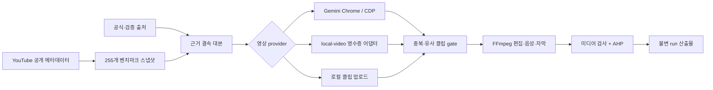

# PS4 AI Video Studio

플스포컴퍼니의 AI Shorts 제작 과제를 염두에 둔 로컬 우선 제작·검증 웹앱입니다. 공개 YouTube 채널 `신비한 건축사전`의 메타데이터와 제목 패턴을 벤치마킹하고, 새 주제의 근거 수집, AI 장면 생성, FFmpeg 편집, 한국어 자막·내레이션, 품질 증거 봉인을 하나의 작업(run)으로 연결합니다.

> 이 저장소는 현재 **제출 준비 중인 엔지니어링 프로토타입**입니다. 2026-08-12에 Headless Chrome의 Gemini가 만든 서로 다른 2개 클립에서 20초 세로 MP4·한국어 자막·내레이션까지 무인 E2E를 완주했습니다. 이미 봉인된 해당 run의 기술 증거 gate는 100/100이지만 의미 gate는 닫혀 있습니다. 이후 새 run은 loopback OMLX 영수증을 추가하며, 모든 의미 증거가 통과한 새 run에 한해서만 gate 승격 대상이 됩니다.

## 현재 검증 상태

2026-08-12에 저장된 스냅샷 기준입니다.

| 영역 | 확인된 상태 |
| --- | --- |
| 채널 인덱스 | 255개 전수: Shorts 251개 + 롱폼 4개, 고유 ID 255개 |
| Shorts 길이 | 전체 중앙값 78초, 최근 30개 중앙값 110초, 최근 사분위 범위 96–122초 |
| 전수 분석 범위 | 255개 제목·조회수·길이·해상도 메타데이터와 휴리스틱 제목 분류 |
| 미디어 분석 범위 | 시간축 분산 12개 컨테이너 분석: 영상 12, 오디오 11, 자막 11, 완전한 LUFS/true-peak 측정 2. 전 채널을 대표하지 않음 |
| 로컬 웹앱 | 채널 탐색, 작업 생성, 진행 상태, 산출물, AHP 계측·기술 증거 gate 표시 구현 |
| Gemini | Chrome 151 Headless, 전용 프로필, 2개 720×1280·10.005초 클립을 생성해 1080×1920·20.033초 최종 MP4까지 완주. 입력 SHA-256 고유, temporal aHash 거리 39.125, motion gate 2/2 통과 |
| FLUX 3 | 공식 BFL API용 `local-video` 어댑터, 비용 상한, 체크포인트·재개, 다운로드 검증 구현. 2026-08-12 확인 당시 API 키 미설정·대시보드 잔액 0이며 유료 호출 및 생성 E2E 미수행 |
| 최종 판정 | 실제 Gemini 고유 다중 클립 + 출처 결속 + 불변 run + 5-method software payload의 기술 gate를 검증. 새 run은 Qwen3.6-27B-8bit 장면/OCR, FFmpeg black-frame, extractive 출처, TTS 생성 provenance 영수증까지 모두 통과해야 의미 gate 후보가 되며 실패·부재 시 `needs-improvement` |

`data/channel-analysis.json`의 “전수 분석”은 공개 메타데이터와 제목 문맥 규칙 분석입니다. `editorialHypothesis`의 서사·시각 언어는 이 제목 분석에서 세운 제작 가설이며 측정된 시청각 관측값이 아닙니다. 모든 영상 내용을 사람이 시청했거나 모든 프레임을 분석했다는 뜻이 아닙니다. 표본 미디어 분석은 별도 영수증으로 분리되어 있습니다.

## 무엇을 구현했나

- `yt-dlp`로 Videos/Shorts 목록을 각각 수집하고 누락된 조회수·길이·해상도가 있으면 스냅샷 저장을 중단합니다.
- 최근 30개 Shorts의 110초 프로필을 새 작업의 기본 목표 길이로 사용합니다.
- 검증 출처를 가져와 SHA-256, 바이트 수, 본문 위치와 인용문을 저장합니다. 대본의 각 주장은 저장된 인용문과 정확히 결속되어야 합니다.
- 세 가지 입력 모드를 지원합니다: Gemini Chrome 생성, 영수증 기반 `local-video` 생성기, 사용자가 제공한 로컬 클립 편집.
- 입력 클립마다 SHA-256과 시간축 perceptual fingerprint를 계산하여 동일·유사 클립을 렌더 전에 차단합니다.
- FFmpeg/ffprobe로 9:16 정규화, 이어붙이기, 음성 합성, 자막 번인, 썸네일 추출, 프레임·음량·무음·자막 검사를 수행합니다.
- 작업별 이벤트 로그, 입력 manifest, provider 영수증, 벤치마크 스냅샷과 최종 산출물을 run ID에 묶어 저장합니다.
- AHP 계측과 별도로 provider provenance, 출처 텍스트, 불변 산출물, 5-method software attestation payload를 요구하는 기술 증거 gate를 둡니다. 이 스키마는 실제 전문가 참여나 신원·독립성, 영상의 주제 관련성·사실성·미학을 증명하지 않습니다.



자세한 구성과 위협 모델은 [`docs/architecture.md`](docs/architecture.md), 오픈소스 선택 근거는 [`docs/oss-decisions.md`](docs/oss-decisions.md)를 참고하세요.

## 요구 사항

- macOS 권장: 내레이션에 시스템 `say`를 사용합니다. `voiceover=false`이면 다른 OS에서도 렌더 경로를 시험할 수 있습니다.
- [Bun](https://bun.sh/) 1.3 계열
- [FFmpeg](https://ffmpeg.org/)와 `ffprobe`
- [yt-dlp](https://github.com/yt-dlp/yt-dlp)
- Gemini 모드 사용 시 Google Chrome/Chromium과 사용자가 직접 로그인한 전용 프로필
- FLUX 3 실호출 시 별도로 발급한 BFL API 키와 크레딧

macOS에서 핵심 미디어 도구는 다음처럼 설치할 수 있습니다.

```bash
brew install ffmpeg yt-dlp
```

도구 버전과 설치 여부는 웹앱의 상태 패널과 `GET /api/health`에서 확인할 수 있습니다.

## 빠른 시작

```bash
cp .env.example .env
bun run start
```

브라우저에서 `http://127.0.0.1:3000`을 엽니다. 서버는 기본적으로 loopback에만 바인딩하며, 첫 문서 탐색에 `HttpOnly; SameSite=Strict` 세션 쿠키를 발급합니다. 모든 API 읽기에는 이 쿠키 또는 로컬 모니터용 Bearer token이 필요하고, 변경 API는 여기에 exact same-origin 검사까지 추가합니다.

개발 중 자동 재시작은 다음 명령을 사용합니다.

```bash
bun run dev
```

### 제작 모드

1. **Gemini · Chrome 자동 조작**: 웹앱에서 `Gemini Chrome 연결`을 누르고 전용 Chrome 프로필에 직접 로그인합니다. 자동화는 로그인, CAPTCHA, 쿼터를 우회하지 않습니다.
2. **local-video 생성기**: 절대 경로의 실행 파일을 `PS4_LOCAL_VIDEO_GENERATOR`에 지정합니다. 생성기는 stdin 요청과 현재 run에 결속된 JSON 영수증을 반환해야 합니다.
3. **로컬 클립 업로드**: 작업 생성 후 여러 클립을 업로드하고 편집을 시작합니다. 이 모드는 편집 검증용이며 AI provider 기술 증거 gate 통과를 주장할 수 없습니다.

모든 작업 산출물은 기본적으로 `workspace/jobs/<job-id>/` 아래에 저장됩니다. `workspace/`는 저장소에 커밋하지 않습니다.

## 벤치마크 재생성

채널 공개 상태는 변하므로 제출 직전에 다시 생성하세요.

```bash
bun run benchmark:refresh
```

이 명령은 아래 순서로 실행됩니다.

```text
channel:refresh → benchmark:metadata → analyze → quality:rlm
```

결과 파일은 다음과 같습니다.

- `data/channel-shorts.json`, `data/channel-videos.json`: 원본 목록 스냅샷
- `data/shorts-metadata.json`: 길이·해상도 통계와 최근 30개 프로필
- `data/channel-analysis.json`: 255개 제목/메타데이터 기반 분류와 provenance
- `data/rlm-benchmark-analysis.json`: 251개 Shorts의 재귀 집계 영수증

미디어 표본은 네트워크와 저장 공간을 사용하므로 별도 실행합니다. 기본값은 시간축으로 분산 선택한 12개입니다. 현재 영수증은 12개 선택과 12개 컨테이너 분석을 증명합니다. 커밋된 영수증은 자막 cue/word 원문과 개별 timing record를 제거하고 집계값·언어·바이트·SHA-256만 보존합니다. 이는 채널 전수의 시청각 의미 분석이 아니라 비대표 표본입니다.

```bash
BENCHMARK_LIMIT=12 bun run benchmark:media
bun run quality:rlm
```

자동 자막도 내려받으려면 `BENCHMARK_SUBS=1`을 추가합니다. YouTube 이용약관과 저작권을 확인하고 필요한 범위에서만 실행하세요.

## Gemini 설정과 모니터링

기본 단일 프로필 설정:

```dotenv
CHROME_CDP_URL=http://127.0.0.1:9222
CHROME_PROFILE_DIR=/Users/you/.ps4-ai-video-studio/chrome-profile
GEMINI_VIDEO_TIMEOUT_MS=600000
GEMINI_CHROME_HEADLESS=1
GEMINI_CHROME_BACKGROUND=0
```

`CHROME_PROFILE_DIR`는 `~/.ps4-ai-video-studio/` 안의 전용 경로여야 합니다. 일상용 Chrome 프로필을 공유하지 마세요. 런타임 기본값은 창을 열지 않는 Chrome `--headless=new`이며 Chrome 109 이상을 요구합니다. CDP는 `127.0.0.1`에만 결속되고, 요청한 headless/visible 모드와 이미 해당 포트에 떠 있는 Chrome의 실제 모드가 다르면 자동화는 새 창이나 요청을 만들지 않고 중단합니다.

최초 로그인 또는 세션 갱신이 필요할 때만 `GEMINI_CHROME_HEADLESS=0`과 `GEMINI_CHROME_BACKGROUND=0`으로 같은 전용 프로필을 열어 사람이 로그인합니다. 로그인 후 그 전용 Chrome을 **완전히 종료**하고 `GEMINI_CHROME_HEADLESS=1`로 되돌린 다음 서버와 모니터를 재시작하세요. 동일한 `CHROME_PROFILE_DIR`의 쿠키·세션이 재사용되지만, 만료된 로그인이나 CAPTCHA는 headless에서 우회하지 않고 명시적으로 실패합니다. `GEMINI_API_KEY`는 근거 결속 대본 생성을 위한 선택 설정이며 Chrome 영상 생성 세션과는 별개입니다.

서버가 실행 중일 때 쿼터 감시와 자동 재개를 시작할 수 있습니다.

```bash
bun run monitor:gemini
```

모니터는 서버가 만든 mode `0600` 토큰 파일을 읽어 Bearer 인증하고, `workspace/gemini-monitor.json` 및 JSONL 로그를 mode `0600`으로 갱신합니다. 계정 이름·이메일, Chrome profile 경로, Gemini 페이지 본문은 상태·로그·UI·API에 저장하지 않으며 이전 버전 산출물도 시작 시 일방향으로 제거합니다. 쿼터 시각·가용성처럼 자동 재개에 필요한 운영 정보만 남깁니다. 기본 최대 실행 시간은 7일입니다. 이 명령은 사용 가능한 쿼터를 발견하면 실제 생성 작업을 만들 수 있으므로 계정·주제·출처 설정을 먼저 검토하세요.

각 쿼터 관측 전에 모니터가 전용 CDP 포트와 저장된 프로필을 확인하며, 프로세스가 내려갔으면 기본 `--headless=new` 정책으로 다시 시작합니다. 이미 열린 Chrome이 요청 모드와 다르거나 로그인 세션이 만료된 경우에는 자동 우회하지 않고 blocker를 기록합니다.

## 승인 provider 클립 동작 gate

Gemini와 `local-video` 생성 클립은 편집 전에 `ffmpeg-luma-motion-32x32-v1` 검사를 통과해야 합니다. FFmpeg가 디코딩한 32×32 grayscale 프레임으로 첫 1초의 동작 시작 시점과 전체 구간의 움직이는 전환율, 고유 프레임율, 인접 근중복률, 최장 정지 구간을 계산합니다. 파일 SHA-256만 다른 단색 정지 영상이나 소수 프레임 반복 영상은 통과하지 못합니다.

측정값과 고정 threshold는 input manifest schema v3에 저장되고, quality 평가가 원본 클립에서 다시 계산한 영수증과 바이트 단위 canonical hash로 일치해야 `inputMotionGateBinding`이 열립니다. 로컬 업로드 모드는 편집 fixture이므로 같은 지표를 표시하지만 제출용 provider gate로 강제하지 않습니다. 이 기술 검사는 콘텐츠 의미를 판정하지 않으며 `semanticGate=false` 정책을 바꾸지 않습니다.

## FLUX 3 / BFL 어댑터

[`scripts/bfl-flux-video-generator.mjs`](scripts/bfl-flux-video-generator.mjs)는 BFL의 공식 `POST /v1/flux-3-video` 계약을 `local-video` 프로토콜에 맞춥니다. 각 장면을 직렬 제출하고, task ID를 체크포인트에 기록한 뒤 polling·HTTPS delivery URL·미디어 크기·SHA-256을 검증합니다. 제출 결과가 모호하면 중복 과금을 피하기 위해 자동 재제출하지 않습니다.

```dotenv
PS4_LOCAL_VIDEO_GENERATOR=/absolute/path/to/scripts/bfl-flux-video-generator.mjs
BFL_API_KEY=
BFL_VIDEO_RESOLUTION=hd
BFL_ESTIMATED_CREDITS_PER_SECOND=17
BFL_MAX_CREDITS=1400
```

실호출에는 **API 키뿐 아니라 양수 비용 추정치와 최대 크레딧 상한이 모두 필요**합니다. 예시는 HD 80초를 1 credit = USD 0.01, 17 credits/초로 가정한 1,360 credits(USD 13.60)에 작은 여유를 둔 값입니다. 가격은 바뀔 수 있으므로 실행 직전에 [BFL 문서](https://docs.bfl.ai/flux_3/flux3_overview)와 대시보드에서 확인하세요. FHD는 별도 단가를 넣어야 합니다.

`BFL_DRY_RUN=1`은 stdin 요청을 검증하고 네트워크 요청 0건의 계획 영수증을 출력합니다. dry-run 영수증은 의도적으로 완성 클립 영수증이 아니므로 웹 파이프라인의 완료 run으로 받아들여지지 않습니다.

2026-08-12 확인 당시 이 개발 환경에는 BFL API 키가 설정되지 않았고 대시보드 잔액은 0이었습니다. 이는 외부 계정의 시점성 상태이며 저장소 영수증이 아닙니다. 저장소의 테스트와 CI는 BFL/Gemini 실서비스를 호출하지 않습니다.

## 테스트

```bash
bun test
bun run check
```

구문 검사까지 로컬에서 CI와 동일하게 확인하려면:

```bash
for file in src/*.mjs scripts/*.mjs public/*.js test/*.mjs tests/*.mjs; do node --check "$file"; done
```

CI는 Bun 테스트, Node 구문 검사, `git diff --check`만 수행합니다. 브라우저 자동화, YouTube 다운로드, Gemini API, BFL API, 유료 생성은 실행하지 않습니다.

## 보안 운영 원칙

- `HOST=127.0.0.1`을 유지하세요. 인증이 있더라도 이 앱을 공용 인터넷에 직접 노출하도록 설계하지 않았습니다.
- `workspace/.runtime/studio-token`과 Chrome 프로필은 비밀로 취급하고 공유·커밋하지 마세요.
- `PS4_STUDIO_TOKEN`을 직접 정하면 공백 없는 32바이트 이상의 무작위 값을 사용하세요. 비워 두면 서버가 매 실행에 생성합니다.
- 업로드는 최대 12개, 파일당 250 MiB, 요청 합계 500 MiB입니다.
- BFL 비용 상한을 비워 둔 실호출은 fail-closed로 중단됩니다.
- AI 결과는 사실 검증, 저작권, 초상권, 상표, 플랫폼 정책에 대한 사람의 최종 검토를 대체하지 않습니다.

## 알려진 한계와 다음 완료 조건

- 2026-08-12 Gemini 저장 스냅샷은 다중 계정 모두 쿼터 차단이었고, 완전한 고유 클립 세트를 받지 못했습니다.
- 같은 날짜 확인 당시 BFL 키 미설정·잔액 0이어서 실제 provider E2E를 실행하지 않았습니다.
- 현재 저장된 채널 미디어 분석은 시간축으로 분산 선택한 12개 표본뿐입니다. 전체 255개 콘텐츠의 시청각 의미를 일반화할 수 없습니다.
- 자막 타이밍은 현재 대본/내레이션 기반 추정 경로를 포함합니다. ASR 강제 정렬을 사용한 사람 수준의 싱크를 아직 보장하지 않습니다.
- 기술 증거 gate에는 실제 승인 provider의 완성 영수증, 서로 다른 모든 클립, 출처의 완전한 단일 문장을 그대로 사용하는 재계산 가능한 extractive binding, 불변 run 폐쇄, 요구된 5-method software attestation payload가 필요합니다. extractive binding은 텍스트 변형을 허용하지 않지만 사실 함의를 판정하지 않습니다. 현재 검증은 payload·파일·계측의 무결성이지 사람의 신원·전문성·독립성 또는 콘텐츠 의미 품질 인증이 아닙니다.
- 새 run은 `runs/<runId>/semantic/`에 loopback OMLX의 검증·정제된 응답, 입력 프레임, canonical 영수증을 남깁니다. 원응답 본문은 비밀값 반사를 막기 위해 저장하지 않고 SHA-256만 기록합니다. 장면 관련성·모든 번인 자막 cue의 blind OCR·FFmpeg black-frame·extractive 출처 결속·`narrationGenerationBinding`이 모두 재검증되고 불변 산출물에 봉인된 경우에만 `contentSemanticsVerified`가 열립니다. 이는 ASR이 아니며(`asrPerformed:false`), OMLX 부재나 JSON 오류는 영상 생성을 폐기하지 않고 `needs-improvement`로 닫힙니다. 기존 봉인 run은 소급 변경하지 않습니다.

제출 준비 완료라고 부르려면 위 조건을 충족한 실제 run의 `final.mp4`, `captions.srt`, `quality.json`, provider 영수증과 `runs/<run-id>/manifest.json`을 함께 검토하고, 별도의 사람 콘텐츠 검토를 기록해야 합니다.

## 라이선스

이 저장소 자체의 라이선스는 아직 지정되지 않았습니다. 따라서 공개 저장소라는 사실만으로 사용·복제·배포 권한이 부여되는 것은 아닙니다. 권리자가 라이선스를 결정한 뒤 별도 `LICENSE` 파일을 추가해야 합니다. 제3자 도구와 조사 대상의 고지는 [`NOTICE.md`](NOTICE.md)에 정리했습니다.
