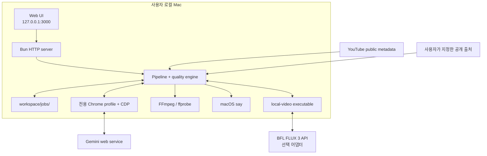
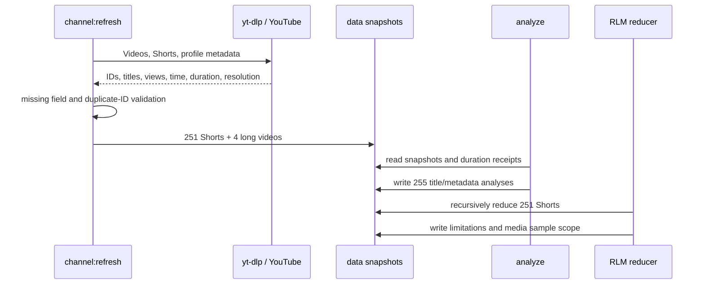
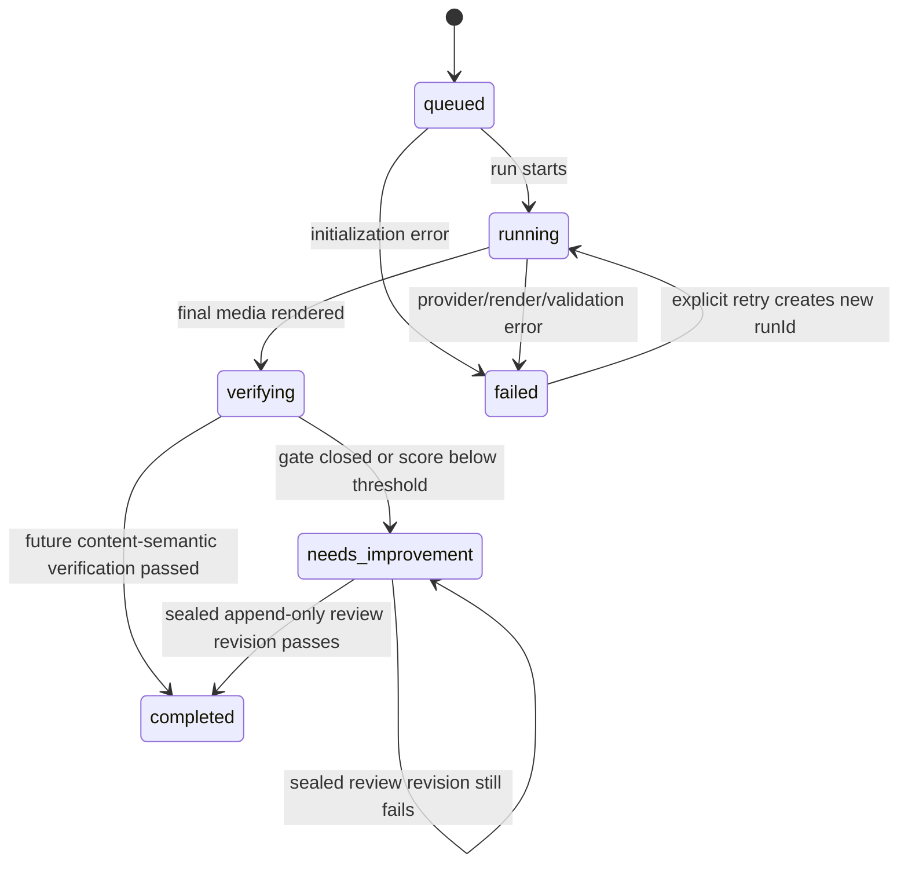

# Architecture and evidence model

## 1. Design goal

PS4 AI Video Studio는 “AI가 영상을 만들었다”는 주장보다 **어떤 요청이 어떤 provider·입력·출처·산출물로 이어졌는지 재검증할 수 있는가**를 우선합니다. 로컬 웹 UI는 제어면(control plane)이고, 파일시스템의 run 디렉터리와 해시 영수증이 증거면(evidence plane)입니다.

2026-08-12 로컬 실행에서 Gemini Headless Chrome은 서로 다른 2개 세로 클립을 생성했고, 파이프라인은 20.033초 최종 MP4·한국어 번인 자막·내레이션·불변 영수증까지 무인으로 완주했습니다. 기술 증거 gate는 100/100이지만 콘텐츠 의미 gate는 아직 열지 않습니다. 현재 구조 검증은 해시·provider·출처 텍스트·미디어 규격과 동작을 증명하며, VLM 장면 관련성·OCR·음성 의미나 게시 적합성을 대신하지 않습니다. 같은 날짜 BFL은 API 키·크레딧 설정이 없어 실제 생성 호출을 하지 않았습니다.

## 2. System context



외부 서비스 인증은 각 서비스의 정상 로그인/API 키 흐름을 사용합니다. 자동화는 CAPTCHA, 로그인 또는 쿼터를 우회하지 않습니다.

## 3. Components

| 컴포넌트 | 파일 | 책임 |
| --- | --- | --- |
| HTTP server | `src/server.mjs` | 정적 UI, 작업 API, 업로드·산출물 전달, 실행 lease, 로컬 인증·origin 검증 |
| Pipeline | `src/pipeline.mjs` | 작업 생성, 출처 캡처, 대본, provider 선택, 입력 manifest, 편집, run 봉인 |
| Gemini adapter | `src/gemini-browser.mjs` | 전용 Chrome 시작/연결, CDP 조작, 화면비·쿼터 확인, 결과 다운로드, 세션 provenance |
| Provider protocol | `src/local-video-provider.mjs` | 실행 파일 stdin/stdout 계약, 클립·해시·모델 영수증 검증 |
| BFL adapter | `scripts/bfl-flux-video-generator.mjs` | FLUX 3 요청, 비용 guard, task checkpoint/poll, 안전한 delivery 다운로드 |
| Media analysis | `src/frame-analysis.mjs` | 프레임, 컷, 무음, 음량, loudness, 자막 타이밍 관측 |
| Quality engine | `src/quality.mjs` | AHP, provider·source·run 결속, 5-method software payload 검증, append-only 품질 revision |
| Run ledger | `src/run-ledger.mjs` | JSONL 이벤트, atomic JSON, 파일 SHA-256, manifest 작성 |
| Benchmark tools | `scripts/refresh-channel.mjs`, `scripts/refresh-benchmark.mjs`, `scripts/analyze-channel.mjs` | 공개 채널 스냅샷, 길이 프로필, 휴리스틱 분류 |
| RLM reducer | `src/rlm-analysis.mjs` | 251개 Shorts 메타데이터를 chunk 단위로 재귀 집계 |
| Monitor | `scripts/monitor-gemini-production.mjs` | 여러 전용 프로필의 쿼터 관측, 작업 생성·재개, 상태·UltraGoal 신호 기록 |

## 4. Benchmark data flow



완전성 조건은 다음과 같습니다.

- Videos와 Shorts가 모두 비어 있지 않아야 합니다.
- 모든 항목에 유한한 `viewCount`와 `durationSec`가 있어야 합니다.
- 두 목록 전체에서 ID가 고유해야 합니다.
- 분석의 `expectedVideos`, `indexedVideos`, `uniqueIds`가 일치해야 합니다.
- production run이 스냅샷을 복사할 때 channel/duration/RLM의 Shorts 개수와 source snapshot generation이 일치해야 합니다.

2026-08-12 저장 스냅샷은 총 255개(251 Shorts, 4 long)입니다. 최근 30개 Shorts의 중앙 길이는 110초이며 사분위 범위는 96–122초입니다. 이는 `data/shorts-metadata.json`의 공개 메타데이터 집계입니다.

제목 분류의 `confidence`는 `heuristic-title-only`입니다. `editorialHypothesis`의 서사·시각 언어는 제목·메타데이터에서 세운 제작 가설이며 측정된 채널 특성이 아닙니다. 프레임·오디오·자막 증거는 `benchmark:media`가 시간축으로 분산 선택한 표본에만 해당하며, 결정론적 재귀 metadata reducer 결과도 이 제한을 명시합니다. 현재 저장된 실행은 12개 컨테이너를 분석했으며 영상 12개, 오디오 11개, 자막 11개, 완전한 LUFS/true-peak 측정 2개입니다. `sampleCount=12`, `mediaEvidenceIsRepresentative=false`입니다.

## 5. Production lifecycle

한 작업은 여러 실행을 가질 수 있지만, 각 실행은 새로운 `runId`를 받습니다.



실행 순서:

1. 작업 설정과 provider fallback 금지 정책을 run manifest에 기록합니다.
2. 현재 benchmark 세대 세 파일을 run 디렉터리에 복사하고 해시를 계산합니다.
3. 사용자가 지정한 출처를 캡처합니다.
4. 캡처된 evidence에서만 대본을 생성하거나 evidence-extract fallback을 사용합니다.
5. 선택한 provider로 장면을 생성하거나 업로드 클립을 선택합니다.
6. 입력 클립 수·해시·지각 지문·디코딩 프레임 동작 영수증을 `input-manifest.json`에 기록합니다.
7. FFmpeg로 정규화·결합·음성·자막·썸네일을 만듭니다.
8. 프레임·오디오·자막 검사와 AHP 평가를 수행합니다.
9. 산출물을 `runs/<run-id>/artifacts/`로 복사하고 바이트 수·SHA-256을 manifest에 봉인합니다.
10. reviewer payload가 나중에 제출되면 기존 base를 바꾸지 않고 `runs/<run-id>/revisions/<revision-id>/`에 append-only revision을 만듭니다.

실행 도중 mutable 파일은 다시 만들어질 수 있지만, 기술 증거 판정은 현재 run ID와 일치하는 해시 검증된 snapshot만 신뢰합니다.

## 6. Provider contracts

### 6.1 Gemini Chrome/CDP

작업은 선택적으로 `geminiCdpUrl`과 `geminiProfileDir`을 함께 저장합니다. 주소는 `http://127.0.0.1:<port>` 또는 localhost여야 하고, 프로필은 `~/.ps4-ai-video-studio/` 아래여야 합니다. 품질 검사는 생성 때 사용한 CDP/profile과 작업에 저장된 값을 다시 비교합니다.

Chrome 런처는 기본적으로 `--headless=new`을 사용하고 원격 디버깅 listener를 `127.0.0.1`에 고정합니다. 새 headless 구현이 있는 Chrome/Chromium 109 이상만 허용하며, CDP의 실제 User-Agent가 요청 모드와 다르면 fail-closed 합니다. 최초 로그인은 명시적으로 `GEMINI_CHROME_HEADLESS=0`인 visible 모드에서 사람이 수행하고, 그 프로세스를 완전히 종료한 다음 동일한 전용 `user-data-dir`을 headless로 다시 엽니다. 세션이 만료되어 Google 로그인 UI가 감지되면 생성 요청을 보내지 않습니다.

각 장면에서 adapter는 다음을 확인합니다.

- Gemini의 동영상 만들기 UI가 존재하고 쿼터 차단 문구가 없는가
- 요청한 9:16 또는 16:9 선택이 실제로 되었는가
- 새로 나타난 결과 미디어인가
- 다운로드 파일의 실제 치수가 요청 format과 맞는가
- `gemini-generation.json`의 request/script/provider/session hash가 현재 run에 결속되는가

기존 실패 run의 일부 클립을 재개할 때도 동일 요청·스크립트·profile provenance와 파일 해시·화면비가 맞아야 합니다. 로그인과 CAPTCHA는 사람이 수행합니다.

### 6.2 Generic local-video protocol

`PS4_LOCAL_VIDEO_GENERATOR`는 인자를 받는 shell command가 아니라 **하나의 실행 파일 절대 경로**입니다. Pipeline이 JSON 한 줄을 stdin으로 보내며, 생성기는 stdout에 JSON 영수증 하나를 반환합니다.

요청 핵심 필드:

```json
{
  "schemaVersion": 1,
  "jobId": "...",
  "runId": "...",
  "provider": "local-video",
  "requestHash": "sha256:...",
  "scriptHash": "sha256:...",
  "segments": [
    { "index": 1, "durationHint": 10, "prompt": "..." }
  ]
}
```

완료 영수증은 `status: "completed"`, provider/model/modelVersion/modelId, 동일한 request/script hash, 모든 1-based segment, `clips/<name>` 경로, 파일 바이트 수와 SHA-256을 포함해야 합니다. 누락·중복 index, 경로 이탈, 중복 path, 파일/해시 불일치가 있으면 run을 중단합니다.

### 6.3 BFL FLUX 3 adapter

BFL adapter는 generic 계약을 구현하는 독립 실행 파일입니다.

- endpoint: `https://api.bfl.ai/v1/flux-3-video`
- mode: text-to-video
- 장면 길이: 5–20초 범위
- aspect ratio: 작업 format에서 9:16 또는 16:9
- 동시성: 의도적으로 1
- live precondition: `BFL_API_KEY`, 양수 비용 추정, `BFL_MAX_CREDITS`
- checkpoint identity: job/run/request/script/request-body hash
- ambiguous submission: 자동 재제출 금지
- polling: 승인된 BFL API origin과 정확한 task ID만 허용
- delivery: HTTPS, 무자격증명, 기본 포트, 승인된 `delivery-<region>.bfl.ai`/`delivery.<region>.bfl.ai` 또는 명시 allowlist
- download: redirect 거부, video content type, 기본 최대 512 MiB, atomic rename, SHA-256

비용 guard는 예상 총 credits가 상한보다 큰 경우 첫 유료 제출 전에 중단하고, 각 다음 장면 전에도 관측 비용과 잔여 추정을 다시 계산합니다. BFL 가격 자체는 provider가 바꿀 수 있으므로 사용자가 현재 단가를 environment에 넣어야 합니다.

### 6.4 Local upload

로컬 업로드는 편집·자막·품질 파이프라인을 검증하는 경로입니다. provider generation 영수증이 없으므로 AHP 계측은 계산할 수 있어도 AI provider 기술 증거 gate에는 적격하지 않습니다.

## 7. Fact and source evidence

출처 URL은 단순 제목 목록으로 대본에 전달되지 않습니다.

1. HTTP(S), 표준 포트, 무자격증명 URL만 받습니다.
2. localhost, private/link-local/reserved IP와 metadata host를 차단합니다.
3. DNS 결과가 모두 public인지 확인하고 선택한 주소로 연결을 고정합니다.
4. redirect를 따라가지 않으며 출처당 20 MiB, 12초, 작업당 12개, 동시성 3으로 제한합니다.
5. 응답 원문 SHA-256, 바이트 수, resolved address와 본문 offset별 evidence quote를 저장합니다.
6. 대본은 `sourceId`, `evidenceId`, exact `quote`를 반환해야 합니다.
7. validator가 quote가 캡처된 evidence의 연속 substring인지 확인합니다.

근거가 부족하면 일반 지식으로 빈칸을 채우지 않고 대본 생성을 중단합니다. quality gate는 요청한 출처 집합과 캡처된 출처 집합, 바이트·해시·evidence 배열, 장면별 claim 연결을 다시 검증합니다.

이 구조는 출처가 진실이라는 사실 자체를 자동 증명하지는 않습니다. 신뢰할 수 있는 1차 출처 선정과 해석은 최종 사람 검토 대상입니다.

## 8. Duplicate-clip gate

입력 manifest schema v3는 세 단계로 장면 다양성과 실제 동작을 검사합니다.

1. 모든 파일의 SHA-256이 고유해야 합니다.
2. 각 영상에서 시간축으로 최대 8프레임을 뽑고 8×8 grayscale average hash를 계산합니다. 모든 쌍의 평균 Hamming distance가 **3보다 커야** 합니다.
3. Gemini와 `local-video` 클립은 FFmpeg 디코딩 프레임으로 첫 1초의 동작 시작, 전체 구간의 움직이는 전환율·고유 프레임율·인접 근중복률·최장 정지 구간을 검사합니다. 정지 영상, 초반 무동작, 소수 프레임 반복 중 하나라도 검출되면 manifest를 봉인하지 않고 실행을 중단합니다.

클립 간 알고리즘 ID는 `temporal-ahash-8x8-v1`, 클립 내부 동작 알고리즘 ID는 `ffmpeg-luma-motion-32x32-v1`입니다. quality 단계는 승인 provider의 동작 영수증을 원본 클립에서 다시 계산해 canonical hash가 일치할 때만 `inputMotionGateBinding`을 엽니다. 로컬 업로드는 같은 지표를 기록하지만 강제하지 않습니다. 이 검사는 복사·정지·단순 반복 영상을 막는 결정론적 휴리스틱이지, 장면의 의미적 차이나 내용 적합성을 증명하는 모델은 아닙니다. 의미적 다양성은 별도 시각 검토가 필요합니다.

## 9. Rendering and quality

렌더 경로는 FFmpeg/ffprobe를 사용합니다.

- format별 scale/pad, H.264 정규화
- concat demuxer로 장면 연결
- macOS `say`의 장면별 음성, 필요 시 `atempo`, loudness normalization
- 원본 장면 오디오는 voiceover 활성 시 음소거
- SRT/VTT 및 FFmpeg subtitles filter 번인
- 최종 파일에서 썸네일 추출
- duration, stream 수, frame/cut, silence, LUFS/LRA/true peak, caption coverage 관측

현재 자막의 word timing은 같은 대본·내레이션의 장면 길이에 비례한 **추정값**을 포함합니다. ASR forced alignment 증거가 아니며 UI와 quality JSON에서 `estimated: true`로 남습니다.

AHP 가중치는 다음과 같습니다.

| 기준 | 가중치 |
| --- | ---: |
| 훅·서사 구조 | 25 |
| 시각 증거·미디어 규격 | 25 |
| 편집 리듬·장면 연결 | 15 |
| 자막·음성·오디오 믹스 | 15 |
| 출처 텍스트 결속·벤치마크 적합성 | 10 |
| 자동화 재현성·실패 복구 | 10 |

총점 98점만으로 기술 증거 검사를 통과하지 않습니다. 승인 provider provenance, current run 결속, 입력 manifest, benchmark 영수증, 불변 evidence, 출처의 완전한 단일 문장을 그대로 사용하는 재계산 가능한 extractive binding, 서로 다른 id/role/method를 가진 5개 software-method payload와 현재 evidence·decision에 대한 canonical attestation hash가 모두 필요합니다. extractive binding은 사실 함의 판정이 아니며, 이 해시는 payload 무결성을 검증할 뿐 실제 전문가 참여, 신원, 전문성 또는 독립성을 인증하지 않습니다.

현재 자동 검사는 프레임 분석 파일과 evidence frame의 존재, 미디어 규격, 컷·자막·오디오 계측을 검증합니다. 프레임이 대본과 의미상 맞는지, 번인 자막이 보이는지, 음성이 대본과 일치하는지, 주장이 인용문에서 논리적으로 함의되는지는 검증하지 않습니다. 따라서 `technicalEvidenceGate`와 별도로 `semanticGate`는 닫혀 있고, 사람 또는 별도 VLM/OCR/ASR/entailment 검토 전에는 제출 적합성을 선언하지 않습니다.

## 10. Threat model

### 보호 대상

- Gemini 로그인 쿠키와 전용 Chrome profile
- BFL/Gemini API key와 유료 credits
- 로컬 studio session token
- 사용자가 업로드한 영상과 생성 산출물
- 출처·provider·reviewer payload provenance의 무결성

### 신뢰 경계와 방어

| 경계 | 주요 위협 | 구현 방어 |
| --- | --- | --- |
| Browser → local server | DNS rebinding, 작업·미디어 읽기, cross-site mutation, LAN 노출 | 기본 `127.0.0.1`, 모든 API의 trusted Host+세션/Bearer, 변경 요청의 same-origin/`Sec-Fetch-Site`, HttpOnly SameSite=Strict cookie |
| Monitor → local server | 토큰·계정 식별자·Gemini 대화 본문 노출 | 무작위 토큰, `workspace/.runtime/studio-token` mode `0600`, monitor 상태·JSONL mode `0600`, email/account/profile/page excerpt 저장 전 제거, 이전 monitor 산출물 시작 시 일방향 scrub, API 응답 재-redaction |
| Upload → filesystem | 메모리 고갈, path traversal | 최대 12개, 파일당 250 MiB, 합계 500 MiB, body 상한, 확장자·안전 경로 검증 |
| Source URL → network | SSRF, DNS rebinding, redirect escape | public address 검증·pinned lookup, private/reserved 차단, redirect 거부, 포트·시간·크기 제한 |
| Chrome CDP | 일상 계정 탈취, 원격 CDP | loopback CDP만 허용, 전용 profile root, 작업에 profile provenance 저장 |
| Generator subprocess | 임의 명령, 위조 영수증 | 단일 실행 파일 경로·실행권한, timeout, run/request/script hash, 경로·파일 SHA 검증 |
| BFL response | 과금 반복, SSRF, secret leak | 비용 상한, ambiguous submission 재제출 금지, origin/host allowlist, redirect 거부, redaction |
| Quality revision | 과거 증거 변조, 위조 reviewer payload | base hash 유지, append-only revision, canonical payload hash, 고유 reviewer/attestation |

### 남는 위험

- 로컬 계정이나 시스템 자체가 침해되면 profile·token·workspace를 보호할 수 없습니다.
- `HOST` 또는 allowed origins를 임의로 넓히면 loopback 전제를 잃습니다. 이 서버는 인터넷 공개 배포용이 아닙니다.
- 외부 웹 UI 변경은 Gemini selector를 깨뜨릴 수 있습니다.
- provider는 과금·쿼터·결과 URL 계약을 바꿀 수 있습니다.
- perceptual hash와 휴리스틱 AHP는 사람의 콘텐츠 판단을 대체하지 않습니다.
- 출처의 사실성, AI 결과의 저작권·초상권·상표·플랫폼 적합성은 별도 검토가 필요합니다.

## 11. Completion evidence checklist

제출 가능한 E2E run은 최소한 다음을 함께 보여야 합니다.

- 실제 Gemini 또는 BFL `completed` provider 영수증
- 요청한 수만큼의 서로 다른 9:16 클립과 통과한 diversity manifest
- 모든 장면 claim의 exact quote/source binding
- `final.mp4`, `captions.srt`, `script.json`, `thumbnail.jpg`
- frame/audio/caption 검사와 단일 오디오 스트림
- benchmark generation이 일치하는 세 snapshot
- 오류 없는 JSONL event ledger와 해시 검증된 run manifest
- current evidence에 결속된 5-method software attestation payload(사람 명단이나 독립 기관 증명 아님)
- `quality.json`의 `technicalEvidenceGate: true`
- 별도의 사람 콘텐츠 검토 또는 검증된 VLM/OCR/ASR/entailment 증거

현재 빌드는 의미 검증을 구현하지 않아 `semanticGate: false`, `status: needs-improvement`를 유지합니다. 저장소 상태는 이 체크리스트를 아직 충족하지 않습니다.
